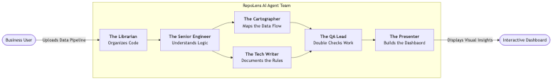
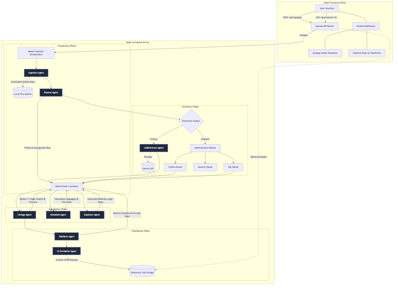

# RepoLens AI Architecture 🔍

RepoLens AI is a multi-agent system designed to automatically ingest, analyze, and document complex data engineering repositories (like ETL pipelines in Python, SQL, or Spark). 

It dynamically traces data sources directly down to their final destinations while mapping transformations chronologically in business-friendly natural language, powered by a hybrid execution engine.

---

## 🚀 Quick Start

1. **Install Dependencies**
   ```bash
   # Install backend dependencies
   cd server
   npm install

   # Install frontend dependencies
   cd ../client
   npm install
   ```

2. **Environment Setup**
   Create a `.env` file inside the `server/` directory and add your Google Gemini API Key:
   ```env
   GEMINI_API_KEY=your_api_key_here
   ```

3. **Run the Application**
   ```bash
   # Terminal 1: Start Backend (Port 3001)
   cd server
   npm run dev

   # Terminal 2: Start Frontend (Port 5173)
   cd client
   npm run dev
   ```

---

## 👔 Business-Friendly Architecture

Think of RepoLens not as a single piece of software, but as a specialized team of AI workers, each with a specific job. You drop off your codebase, and the team collaborates to map out exactly how your data flows and transforms.



### Meet the AI Team (Agent Roles)

- **The Librarian (Ingestion & Planner Agents)**: Quickly gathers all your uploaded code files, sorts them, and decides what actually contains logic and what is just irrelevant boilerplate.
- **The Senior Data Engineer (Extractor Engine)**: Reads the complex scripts and database queries, figuring out the actual intent of the code (e.g., "This block of code is filtering out inactive accounts"). 
- **The Cartographer (Lineage Agent)**: Plays connect-the-dots. It figures out how data moves from raw tables all the way to your final business reports, drawing an end-to-end map of your data flow.
- **The Technical Writer (Explainer Agent)**: Synthesizes the engineering logic into clear, step-by-step, plain-English documentation explaining every business rule your pipeline applies.
- **The Quality Assurance Lead (Validator Agent)**: Double-checks the final map for broken links, unused datasets, or major architectural flaws.
- **The Presenter (UI Formatter Agent)**: Neatly packages all these findings into visual diagrams and reports to be displayed beautifully on your interactive dashboard.

---

## ⚙️ Technical Concept Architecture

RepoLens operates on a hybrid parsing model: a primary **LLM-first semantic extraction** engine powered by Gemini, and a robust **Deterministic Fallback** mechanism utilizing custom regex-based parsers to guarantee graph connectivity even when API quotas are exhausted.

### System Architecture Diagram



### How It Works: The Execution Pipeline

RepoLens utilizes a sequential, agent-based architectural pattern where a central `SharedState` object is passed down the pipeline, accumulating data at each step.

#### 1. Preparation Phase
- **IngestionAgent**: Receives a GitHub URL from the user, clones or downloads the repository, and extracts it to a temporary local directory.
- **PlannerAgent**: Scans the directory structure. It ignores completely irrelevant files (like images or binaries) and categorizes the rest by language (`.py`, `.sql`, etc.). It creates an initial execution plan of which files need deep parsing.

#### 2. Extraction Phase (The Hybrid Engine)
This is the core parsing engine of RepoLens.
- **LLMExtractorAgent (Primary)**: Takes the code files and sends them to the Gemini API with strict JSON schema requirements. It asks the LLM to understand the semantic intent of the code (What are the data sources? What are the transformations? What are the sinks?).
- **Deterministic Parsers (Fallback)**: If the LLM extraction fails (e.g., due to rate limits or API errors), the system falls back to regex-heavy, AST-like custom parsers (`PythonParser`, `SQLParser`). These parsers employ function-scoped tracking to map out data flows and schemas deterministically line-by-line.

#### 3. Aggregation Phase
- **LineageAgent**: Reads all the isolated inputs and outputs extracted in Phase 2. It collects DDL schemas globally and resolves the puzzle, connecting data sources to data targets (e.g., linking `workingzone/author` -> `processedzone/authors`). It attaches inherited columns to every node.
- **ExplainerAgent**: Synthesizes the exact data logic (grouping, filtering, sorting, deduplication) applied during the pipeline, generating chronological, human-readable documentation.
- **MetadataAgent**: Calculates high-level repository statistics, framework usage (Spark, Pandas), and file dependencies.

#### 4. Validation & Finalization Phase
- **ValidatorAgent**: Runs sanity checks against the generated lineage graph. It flags high-severity issues like circular dependencies, orphaned nodes (data written but never read), or missing transformation documentation.
- **UIFormatterAgent**: Takes the massive `SharedState` object and trims it down into a clean, predictable JSON schema.
- This JSON is stored locally against a `jobId`, which the React frontend continuously polls. Once the frontend receives the formatted JSON, it plots the lineage using visualization libraries and populates the dashboard.
